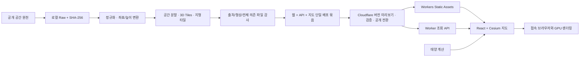

# KOREA REPLAY 전체 설계

## 목표와 완료 조건

처음 방문한 사람이 대한민국 지도를 열어 동네를 확대하고, 같은 장소의 시각을 바꾸며 햇빛·이동·날씨를 이해할 수 있어야 합니다. 전국 범위를 유지하면서 데이터가 없는 지역·시간은 명확히 알립니다. 서울 사례의 경험을 참고하되 자체 데이터 처리와 화면을 구현합니다.

기본 서비스 범위와 화면 진입점은 대한민국 전체입니다. 현재 개발 우선순위는 전국 도시·장소 탐색, 패널 축소와 개별 표시 제어, 지도 집중 모드, 로딩·이동 성능 개선입니다. 지역별 원천의 범위와 품질 차이는 해당 지역의 데이터 상태로 표시합니다.

정적 서비스 배포와 상시 관측 수집은 별도로 판정합니다. 확보한 전국 자료의 처리 범위·결측·공개 URL·출처·공유 복원을 검증한 뒤 정적 버전을 게시합니다. 전국 실제 건물의 정확성과 상시 버스·열차·위성 수집까지 완료됐다는 의미는 아닙니다. 실제 실행 결과는 [검증 기록](VALIDATION.md)을 따릅니다.

## 사용자 흐름

1. 대한민국 전체 지도로 진입합니다.
2. 지역을 검색하고 건물·철도·버스·지하 역사·기상 레이어를 선택합니다.
3. ‘기록 재생’에서는 보유 기록을, ‘햇빛 실험’에서는 사용자가 지정한 시각을 탐색합니다.
4. 건물·정차 기록·역사를 선택하여 출처, 기준일, 관측과 계산의 차이를 확인합니다.
5. 장소·카메라·시각·레이어·데이터 릴리스와 배포 버전을 함께 링크에 저장합니다.

현재 관측의 버스 조회는 공식 도시 목록에서 도시를 직접 선택한 뒤 해당 도시의 노선을 검색하는 흐름입니다. 도시를 선택하기 전에는 특정 노선을 조회하지 않으며, 위치 미지원·목록 확인 실패·등록 노선 없음 상태를 구분합니다. 전국 탐색 범위가 전국 모든 노선의 관측 제공을 뜻하지는 않습니다.

## 데이터 원칙

| 정보 | 저장·표현 원칙 |
|---|---|
| 지형 | 원본 고도와 수직 기준을 보존하고 EGM96에서 WGS84 타원체 높이로 변환 |
| 건물 | 원천 높이 → 층수×3m 추정 → GHSL 2018년 100m 격자 평균 추정 → 높이 미확인 외곽 |
| 버스 | 실제 API를 조회한 시점부터 기록. 원천 관측 시각이 없으면 조회 시각임을 표시 |
| 열차 | 도착·출발 기록을 보존. 정차 위치와 역 사이 계산 위치를 실제 GPS처럼 표현하지 않음 |
| 역사 심도 | 호선·역명/코드로 정확히 연결. 선로 기준과 승강장 기준을 구분. 음수 깊이를 지하로 뒤집지 않음 |
| 레이더 | 반사도 dBZ, 무에코, 관측영역 밖을 구분. 임의 강우량 변환 금지 |
| 위성 | 채널·단위·시각·좌표 체계를 검증. 밝기나 온도를 실제 구름 체적·높이로 단정하지 않음 |
| 햇빛 | 좌표·UTC 시각에 의한 천문 계산. 그림자는 현재 모델 정확도에 종속 |

모든 레코드에는 가능한 범위에서 `source_id`, `source_record_id`, `dataset_version`, `observed_at`, `retrieved_at`, `input_hash`, `transform_version`, `evidence_type`, 단위·수직 기준을 둡니다. 관측·공식 기록·원천 속성·시간표·계산·추정·미확인을 구분합니다.

## 시스템 구조

Python은 로컬에서 대량 공간 변환·정규화·감사를 담당합니다. Worker는 조회 API만 담당하며 기본 배포에는 R2·D1·예약 작업이 없습니다. 대용량 NetCDF·전국 공간 변환을 Worker 요청 안에서 실행하지 않습니다. 게시된 파일은 노트북이 꺼져도 제공되지만, 원천 갱신에는 배치를 다시 실행해야 합니다.

기본 UI는 `/data/catalog.json`의 CatalogV2와 카메라 영역에 겹치는 지역별 목록만 읽습니다. 목록의 크기·SHA를 검증하고 변경 없는 릴리스는 재사용합니다. 기존 `/api/v1/catalog`는 사전 생성한 전체 v1 문서를 스트리밍해 조회 계약을 유지합니다. 범위 API는 작은 범위 전용 색인을 사용합니다.

검색은 5만 개 장소를 사전 정규화하고 부분문자열 역색인·행별 byte offset으로 분할합니다. 브라우저 Dedicated Worker가 필요한 조각만 읽고 최대20개 결과를 전달합니다. 서버 검색 API도 같은 알고리즘을 사용합니다. 실제 결과 순서와 한국어·영문 별칭은 이전 검색과 대조하며, Free CPU 충족 여부는 원격 요청의 성공/실패로 별도 검증합니다.

## 공간 설계

- 지형은 quantized-mesh, 건물은 glTF 2.0을 포함한 3D Tiles 1.1입니다.
- 건물 좌표는 지구 중심 좌표에서 지역 ENU 좌표로 바꾸어 정밀도를 유지합니다.
- 3D Tiles 메타데이터는 개별 건물의 높이·표현 방법·출처를 유지합니다.
- 전국 지형과 지역 정밀 타일은 하나의 타일 트리로 합칩니다. 중복 좌표의 타일 바이트가 다르면 병합을 중단합니다.
- 전국 건물은 공간 작업 구역별로 나누고 체크포인트에서 재개해야 합니다. 단일 거대 GeoJSON을 브라우저로 보내지 않습니다.
- 건물은 전국→도시·동네의 5단계 LOD→전체 상세 모델 계층입니다. 직접 상세 자식은 최대 7파일·23.94MiB이며 중간 표현은 원천 건물의 대표 부분집합입니다. 작은 상세 파일은 같은 구역 안에서 약4MiB까지 병합하고, 공통 ENU 좌표 변환의 추가 반올림 오차를 전 정점에 대해 검사합니다. [계층 생성과 검증](HIERARCHY.md).
- Cesium의 `skipLevelOfDetail`을 사용하고 비가시 형제·비행 목적지의 선행 적재를 끕니다. 기본 REPLACE 방식은 화면 밖의 형제까지 먼저 요구하므로 큰 지역에서 반복 다운로드를 일으킬 수 있습니다. 같은 SSE 값을 다시 대입하지 않아 엔진이 메모리 부족에 맞춰 조절한 상세도가 유지됩니다.
- 높이 원천값과 표시값을 분리합니다. 의미·층수·지표고와 충돌한 건물은 원본 속성을 보존한 검토 외곽선으로 표시합니다. 음의 지표고를 일괄 0으로 바꾸지 않습니다.
- 도로·시설은 Geometry Worker의 형상 해석과 배치 Primitive 렌더링을 사용합니다. 상세 선택 정보는 클릭할 때 구성하고, 공간 선택에는 파일 크기·정점·메모리 예산을 적용합니다.
- GeoJSON의 실제 피처·정점·바이트를 게시 전에 전수 대조하고, 브라우저도 선언보다 많은 정점이 들어오면 Cesium 할당 전에 거부합니다. 화면 밖 Primitive는 경량 16MiB·10만 정점, 균형 20MiB·12.5만 정점, 정밀 24MiB·15만 정점 안에서 재사용하며 메모리 압박·레이어 해제·릴리스 전환 때 정리합니다.
- 도로·철도의 지표 투영은 교량 높이·터널 심도의 실측 자료가 아닙니다.
- 역사 심도는 점·수직선과 검증된 연속 역 사이 선로로 나타냅니다. OSM 수평 형상에 공식 양끝 심도를 거리 비례 보간한 선로이며, 실측 터널 단면·경사·승강장 3D 형상이 아닙니다.

## 시간 설계

저장은 UTC ISO 8601, 화면은 Asia/Seoul입니다. API 조회에는 시간대를 요구하며 한 번에 24시간 이내만 허용합니다. 차량 위치는 두 관측 사이에서만 계산하고, 최대 허용 간격을 넘는 공백과 마지막 관측 이후를 외삽하지 않습니다. 열차의 단일 역 정차 기록은 그 정차 구간에만 나타납니다.

공간 기준일과 교통·기상 관측일을 분리합니다. 과거 시각으로 이동했다고 현재 건물 모델이 당시 건물로 바뀐 것으로 표현하지 않습니다.

시각 변경은 교통수단과 태양만 갱신하고 정적 지도 선택은 날짜·카메라·레이어가 바뀔 때 계산합니다. 기상 이미지는 실제 프레임 경계에서 교체합니다. 자동 화질은 지속적인 프레임 저하에만 단계적으로 반응하며, 이동 중 그림자를 끄고 정지 후 품질별 그림자 해상도로 복원합니다.

점 시설의 지면 높이는 이동 중 재계산을 멈추고, 카메라 정지·지형 공급자·지형 상세도 변경 뒤 실제 지형 준비가 끝났을 때 최신 revision만 반영합니다. 레이더 이미지의 다운로드 완료는 지형 revision을 바꾸지 않습니다.

같은 출처의 `/data/*` 다운로드는 Service Worker에서 본문 수신이 끝날 때까지 최대 4개 슬롯을 공유합니다. 브라우저·모듈 Worker·Cesium의 요청을 모두 포함하며, 시작 시 제어 상태를 확인합니다. 지원되지 않는 환경에서는 최적화 제한을 표시합니다. 지역 목록 캐시는 최대 512개·원본 JSON 8MiB 범위에서 재사용하고 진행 중 요청은 소비자 하나의 취소로 폐기하지 않습니다.

## 공개와 복구

배포 계획은 카탈로그에서 실제 참조하는 모든 파일을 따라가서 만듭니다. GLB·외부 tileset·지형·기상·검색 조각의 존재, SHA-256, 크기와 파일 수를 검사합니다. 별도 묶음에 웹·Worker·지도 파일을 함께 보관하고 정적 파일20,000개/개별24MiB 안전 한도를 강제합니다. 미리보기 검증 후 공개 주소를 연결하며, 복구는 이전 Worker 버전과 정적 자산을 함께 전환합니다. 공유된 버전이 없으면 최신으로 대체하지 않습니다. [무료 배포·복구 절차](STATIC_DEPLOYMENT.md).

상시 관측 수집기는 기본 비활성입니다. 승인된 키와 보관 조건을 확보한 별도 수집 환경에서 실행하더라도 `private/staged` 후보만 작성하고, 검수를 거치지 않은 수집 결과가 공개 카탈로그를 바꾸지 않습니다. 비밀키와 원본 관측은 공개 묶음에 포함하지 않습니다.

## 검증 지표

| 구분 | 확인할 내용 |
|---|---|
| 데이터 범위 | 전국 작업 구역 완료/미완료, 건물 높이별 건수, 역사 미연결·오류 건수 |
| 교통 | API 성공률, 실제 신규 관측 수, 최신 조회 시각, 공백 길이, 페이지 완전성 |
| 기상 | 관측 시각·좌표 정합성, 원시값의 결측/무에코 구분, 공개 색상 영상의 구분 불가 고지, 단위·보정 검증 |
| 화면 | 첫 장면 표시, 시각 이동, 지역 이동, 선택 정보, 모바일 조작, 공유 복원 |
| 운영 | 로컬 전체 파일 감사, 원격 표본 해시·HTTP 계약·캐시·404, 공개 버전 전환·복구, 무료 API 한도 |

데이터 범위, 코드 테스트, 실제 API 연결, 공개 배포, 운영 안정성은 별도 상태로 보고합니다.
