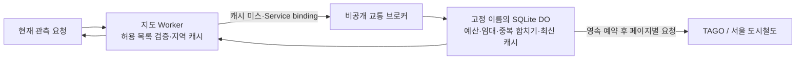

# 실시간 교통 API 중앙 호출 예산 설계

검토일: 2026-09-19 KST. **중앙 브로커를 공개 지도에 연결하고 동시 요청·캐시·SQL 계측·롤백을 검증했습니다.** 현재 배포는 [중앙 교통 서버 배포 기록](CENTRAL_LIVE_DEPLOYMENT.md)을 따릅니다. 아래 표와 초기 구현 수치는 설계 당시의 기록이며, 현재의 미배포 상태를 뜻하지 않습니다. 실제 인증키, 인증 URL, 개인정보는 포함하지 않습니다.

| 상태 | 확인한 범위 |
|---|---|
| 로컬 구현 | `worker/live-broker.ts`의 고정 대상 요청·페이지별 guarded fetch·중복 합치기·오류 차단, `worker/live-broker-store.ts`의 SQLite 예산·임대·최신 캐시 |
| 로컬 통합 준비 | `worker/live-transit.ts`의 `fetchCanonicalTransitSnapshot` export를 실제 fixture 검사에서 사용합니다. 루트 작업자가 추가한 `worker/live-broker-entry.ts`와 `wrangler.live-broker.jsonc`의 바인딩·class·비공개 설정을 읽어 확인했습니다. |
| 로컬 검증 | 신규 브로커 31개, 기존 원천 export 4개, 교통 54개를 합한 89개 검사 통과. 실제 `node:sqlite`로 SQL과 재시작 상태를 검사했습니다. |
| 아직 미완료 | 지도 Worker의 Service binding/공유 quota 계약/배포 stage·preflight 통합, 최초 DO 생성, 원격 지역 간 동시성, Cloudflare 실제 자원 사용량, 브로커 롤백·DB 복구 |

인증키 연결과 중앙 호출 제어는 별도 검증입니다. 최종 공개판은 실제 브로커 응답을 확인해 `global_enforced:true`를 반환하며, 브로커 연결 실패 시 직접 원천으로 우회하지 않습니다. 구버전과 외부 소비의 예외는 계속 유지합니다.

## 1. 추천과 완료 범위

**별도 비공개 Worker `korea-replay-live-broker`와 SQLite Durable Object(DO) 하나를 두고, 지도 Worker는 Service binding으로만 교통 원천을 조회하는 구성을 추천합니다.** 현재 지도·정적 파일의 배포 절차는 유지합니다. 최초 범위는 TAGO 버스 위치와 서울 도시철도 상태이며, 기상·철도 이력·전국 연속 수집까지 중앙화했다고 표현하지 않습니다.

이 구조의 완료 조건은 다음과 같습니다.

- 어느 지역의 지도 Worker에서 요청하더라도 같은 원천 할당량과 동시 실행 상한을 적용합니다.
- 실제 원천 HTTP 페이지를 요청하기 **전에** 호출 예산을 영속 기록합니다. 재시작·캐시 초기화·키 교체로 사용량이 0이 되지 않습니다.
- 같은 도시·공식 노선을 동시에 조회하면 원천 요청을 합칩니다. 공개 노선 ID·이름과 원천 ID를 혼동하지 않습니다.
- 브로커 또는 영속 저장이 실패하면 새 원천 호출을 중단합니다. 직접 호출로 우회하거나 만료 자료를 현재 관측으로 반환하지 않습니다.
- 지도 코드·자료의 기존 미리보기 및 롤백과 브로커의 독립 배포·상태 복구를 각각 검증합니다.

**통제 범위는 이 브로커를 통과하는 호출입니다.** 같은 인증키를 사용하는 외부 프로그램과 기존 직접 호출 버전까지 자동으로 제한되는 것은 아닙니다. 이 경계는 8절에 명시합니다.

## 2. 분리 전 구현에서 확인한 근거

아래 줄 번호는 최초 설계 검토 시점의 코드 기준입니다. 이후 원천 파서의 export 분리로 `worker/live-transit.ts` 줄 번호가 이동했으며, 기존 공개 handler의 지역 제한 경로는 계속 별도로 존재합니다.

| 위치 | 현재 동작 | 중앙화 시 필요한 변경 |
|---|---|---|
| `worker/live-transit.ts:125–131` | `Map`의 원천별 사용량을 KST 자정에 초기화합니다. isolate 소멸 시 사라집니다. | 사용량·차단 상태·실행 임대를 DO SQLite로 옮깁니다. |
| `worker/live-transit.ts:133–136,163–165` | `readJson()`마다 먼저 예산을 차감합니다. 버스는 최대 2페이지이며 페이지별 실제 요청을 셉니다. | 이 순서를 유지하되 영속 기록 완료 후 원천 HTTP를 실행합니다. |
| `worker/live-transit.ts:235–264,304–312` | 메모리·지역 Cache API·isolate 내 중복 합치기, 전체 최대 2개 조회 작업이 있습니다. | 지역 캐시는 유지하고, 캐시 미스의 중복 합치기와 최대 2개 작업을 중앙에서도 적용합니다. |
| `worker/live-transit.ts:299–317` | 버스 캐시 키는 대소문자를 보존한 공식 도시·노선 및 인증·정책 범위를 사용합니다. 반환 시 요청한 공개 ID·표시명을 복원합니다. | 중앙 키에서도 이 의미를 보존합니다. TTL·배포 버전으로 **예산 객체**를 나누지는 않습니다. |
| `shared/live-transit.ts:63,73` | `global_enforced:false`와 `global_quota_enforced:false`가 타입에도 고정돼 있습니다. | 중앙 경로와 기존 경로를 구별하는 명시적인 계약을 추가합니다. |
| `pipeline/static_release.py:444` | stage가 Wrangler 설정을 새로 만듭니다. 루트 `wrangler.jsonc` 수정만으로 배포에 반영되지 않습니다. | 생성 설정에 허용된 Service binding을 넣고 설정 해시에 포함합니다. |
| `scripts/deploy-release.mjs:18–37` | 기존 Worker는 `versions upload`; `--initialize`는 존재하지 않는 `korea-replay`에만 `deploy`를 허용합니다. | 별도 브로커 초기화 절차를 둡니다. 기존 초기화 예외를 넓히지 않습니다. |
| `worker/live-weather.ts:268–285` | 기상은 별도 지역 캐시·직접 원천 HTTP 경로입니다. | 이번 교통 브로커의 전역 보장에 포함하지 않습니다. |

버스 10,000회와 지하철 1,000회 중 80%를 쓰는 현재 값은 구현의 기본 정책입니다. 실제 승인된 서비스별 한도와 초기화 시각을 별도로 확인해야 합니다. TAGO 공개 안내는 개발계정 10,000회를 표시하지만, 확인한 페이지에는 자정의 시간대가 명시돼 있지 않습니다. [TAGO 버스위치정보](https://www.data.go.kr/data/15098533/openapi.do)

## 3. 배치와 내부 계약



Service binding은 공개 URL 없이 같은 계정의 다른 Worker를 호출할 수 있습니다. 브로커는 `workers_dev:false`, `preview_urls:false`, 공개 routes·custom domains 없음으로 구성하고, 별도 유료 서비스나 저장소를 연결하지 않습니다. [Cloudflare Service bindings](https://developers.cloudflare.com/workers/runtime-apis/bindings/service-bindings/)

추천하는 구체적 경계는 다음과 같습니다.

1. 지도 Worker가 지금처럼 공개 ID를 서명된 정적 노선 목록에서 해석합니다. 브로커에는 `{protocol:1, kind, city_code, route_id}` 또는 고정된 지하철 노선 식별자만 전달합니다. 인증키·임의 URL·호스트·페이지 크기·호출 예산·임의 TTL은 받지 않습니다.
2. 비공개 브로커도 타입·문자열 길이·노선 형식을 재검증합니다. 공식 endpoint, 페이지 크기 100, 최대 2페이지, JSON 최대 256KiB/페이지, timeout은 서버 코드의 정책입니다. 서울 노선은 고정 허용 목록으로 확인합니다.
3. 브로커는 하나의 고정 DO 이름(예: `transit-production`)을 사용합니다. 도시·노선·지역·공개/미리보기·배포 버전마다 DO를 생성하지 않습니다. 버스와 지하철의 예산 행은 분리하되 **전체 동시 작업 최대 2개**를 유지하여 현재 제한을 약화시키지 않습니다.
4. 원천 호출과 완전성 검사·정규화는 DO 내부의 한 조회 작업에서 수행합니다. 지도 Worker에 허가 토큰만 반환하여 외부에서 HTTP를 실행하는 방식은 쓰지 않습니다. 토큰 사용 확인과 실제 요청 사이의 재시도·재시작 경계를 관리하기 어렵기 때문입니다.
5. 현재 `busSnapshot/subwaySnapshot/readJson`의 검증을 재사용할 수 있도록 최소한으로 분리합니다. 프런트에는 지금과 같은 완전한 스냅샷을 반환합니다. 페이지별 캐시를 임의로 섞어서 서로 다른 시점의 한 노선을 만들지 않습니다.
6. 브로커의 정규화 결과는 공식 ID를 기준으로 저장하고, 지도 Worker가 요청한 공개 `target.id/label` 및 버스 표시명을 마지막에 복원합니다. 차량의 `route_id`는 계속 공식 원천 ID입니다.

인증키는 브로커의 secret에만 둡니다. 다만 현재 `DATA_GO_KR_SERVICE_KEY`는 지도 Worker의 기상 API에도 사용되므로, 교통 이동만으로 이 키를 지도 Worker에서 제거할 수는 없습니다. 기상까지 별도 이전하거나 공급자 지원 범위에서 키를 분리하기 전에는 이 예외를 유지·기록합니다.

## 4. 호출 예산·동시성·재시작

### 영속 상태

고정 DO 안에 필요한 상태만 둡니다.

| 상태 | 예시 필드 | 보존 원칙 |
|---|---|---|
| 원천 정책 | `source_id, budget_scope, policy_version, limit, blocked_until` | 서버 정책이며 요청 매개변수로 변경하지 않습니다. |
| 사용량 | `source_id, hour_bucket, reserved_count` | 확인 전에는 보수적인 24시간 이동 구간을 적용합니다. |
| 인증 오류 차단 | `source_id, credential_epoch, blocked_until` | 동일 인증 세대의 다른 대상도 300초 차단합니다. 새 키는 재검증하되 사용량은 보존합니다. |
| 실행 임대 | 고정 슬롯 2개, `job_id, canonical_target, credential_epoch, deadline` | 재시작 때 즉시 비우지 않습니다. |
| 최신 스냅샷 | 정규화된 대상 키, `retrieved_at, expires_at, body, bytes` | 제한된 최신 캐시이며 운행 이력 저장소가 아닙니다. |

### 페이지 한 번을 보내는 순서

1. 중앙 캐시와 이미 진행 중인 동일 대상 작업을 먼저 확인합니다. 적중은 원천 호출 예산을 차감하지 않습니다.
2. 새 작업에 빈 슬롯이 없으면 짧은 `Retry-After`와 `busy`를 반환합니다. 무제한 대기열을 만들지 않습니다.
3. `transactionSync()` 안에서 정책·현재 사용량·차단 상태를 확인하고, 해당 페이지 1회분과 실행 임대를 기록합니다. 이어 `await storage.sync()`가 성공한 뒤 HTTP를 시작합니다. DB 기록 실패 시 원천 호출은 0회여야 합니다. 이 API는 SQLite 트랜잭션과 대기 중 쓰기의 영속 완료 확인을 제공합니다. [SQLite Storage API](https://developers.cloudflare.com/durable-objects/api/sqlite-storage-api/)
4. 헤더만 받은 시점에 슬롯을 해제하지 않습니다. 제한된 본문 수신·취소 정리가 끝날 때까지 유지합니다. 버스 두 번째 페이지는 첫 번째 결과로 필요성이 확인된 때에만 별도로 1회 예약합니다.
5. 실패·timeout·비정상 JSON·원천 429도 이미 나간 HTTP 시도이므로 예약을 환불하지 않습니다. 예약 이후 HTTP 전 재시작은 보수적으로 소비된 것으로 남깁니다. 따라서 기록은 **확정 성공 수가 아니라 허용한 최대 HTTP 시도 수**입니다.
6. 원천 quota 오류는 중앙 차단 상태로 저장합니다. 짧은 오류 캐시가 만료됐다고 다른 노선을 통해 계속 원천을 호출하지 않습니다. 인증 실패는 원천·인증 fingerprint별로 300초 영속 차단하여 다른 대상/재시작으로 반복하지 못하게 합니다. 키 교체는 인증 차단만 분리하며 원천 사용량은 유지합니다. 인증 오류 기록은 원천당 최대 4개 세대로 제한합니다.
7. 정상 완료 시 스냅샷을 저장하고 임대를 해제합니다. 저장 또는 해제에 실패하면 임대는 만료까지 남으며 다음 호출은 닫힌 상태로 처리합니다. 생성자에서는 저장된 사용량을 0으로 다시 만들지 않습니다.

DO의 단일 실행 특성만으로 `await fetch()`를 사이에 둔 논리적 동시성까지 자동 해결된다고 가정하지 않습니다. 작업 공유 Promise는 첫 비동기 대기 전에 등록하고, 예산·슬롯은 원자적으로 예약합니다. DB 초기화 이외의 원천 네트워크 전체를 `blockConcurrencyWhile()`로 감싸지는 않습니다.

재시작 후 남은 임대는 기존 최대 요청 시간보다 충분히 긴 기한(예: 15초 요청에 30초 임대)을 지나야 회수합니다. 정상 실행에서 임대만 만료됐다고 살아 있는 요청과 겹쳐 새 작업을 열면 안 됩니다. 먼저 abort 및 본문 취소 완료를 확인합니다. 재시작 때는 과거 진행 건을 재전송하지 않고, 보존된 예약과 임대에 따라 재개합니다.

여기서 보장하는 동시성은 **우리 브로커가 관리하는 원천 HTTP 연결/시도**입니다. 연결 종료 후 공급자 내부에서 남아 있는 처리까지 완료됐다는 사실은 클라이언트 코드로 입증할 수 없습니다. 이 차이는 재시작 검증 보고에도 남깁니다.

### 취소와 장애

동일 대상 요청자 중 한 명의 취소가 다른 요청자의 공유 작업을 끊지 않게 현재 의미를 유지합니다. 이미 시작한 작업은 자체 timeout 안에서 완료·캐시될 수 있지만, 취소된 클라이언트에는 결과를 되살리지 않습니다. 원천 시작 전 취소는 예약 없이 끝낼 수 있습니다.

브로커 미연결·응답 실패·DB 한도 초과·알 수 없는 프로토콜에서는 신규 원천 요청을 하지 않습니다. 아직 유효한 지역 캐시만 기존 만료시각 그대로 제공할 수 있습니다. 만료 후에는 `unavailable`과 명시적인 오류를 반환하고 차량을 제거합니다. `broker_unavailable` 같은 오류 코드를 계약에 추가하되 공급자 인증 오류로 위장하지 않습니다.

## 5. 하루의 경계와 인증키 교체

**Cloudflare 무료 한도의 초기화는 UTC 00:00으로 확인됐습니다. 공급자 호출 한도의 초기화 시간은 별개입니다.** 현재 `nextKstDay()` 구현과 그 회귀 테스트는 KST 자정이라는 우리 정책을 입증할 뿐, TAGO·서울의 공식 초기화 규칙을 입증하지 않습니다. [Cloudflare DO 요금 및 무료 한도](https://developers.cloudflare.com/durable-objects/platform/pricing/)

권장 기본값은 공급자 근거를 확보할 때까지 다음처럼 보수적으로 처리하는 것입니다.

- 현재 시각으로부터 24시간과 겹치는 **현재 시간 버킷 및 이전 24개 시간 버킷**의 합을 제한합니다. 최장 25시간분을 셀 수 있지만, 확인되지 않은 자정에 예산을 두 번 푸는 문제를 피합니다. 소규모 고정 행만 필요합니다.
- 공급자가 고정 UTC/KST 일일 초기화를 공식 명시하거나 본인 승인 화면에서 확인되면, 그 근거·확인일·계정 서비스 한도와 함께 명시적 정책으로 전환합니다. 전환 직후에는 기존 사용량을 버리지 않습니다.
- 시계가 뒤로 간 경우 저장된 마지막 평가시각보다 이전으로 창을 이동해 예산을 다시 풀지 않습니다. 시간대·한도 변경도 새로운 DO 생성 사유가 아닙니다.
- 키를 교체하면 인증 세대와 응답 캐시는 바꾸되, 동일 원천 계정/서비스의 사용량은 그대로 유지합니다. 키 문자열의 해시를 DO 이름으로 사용하면 키 교체 때 예산이 새로 생기므로 금지합니다.
- 키의 fingerprint는 내부 중복·캐시 구분에만 쓰고 로그·공개 응답에는 내보내지 않습니다. 별도 계정이나 서비스로 예산을 나누는 것은 실제 별도 할당량이 확인된 경우에만 허용합니다.

`global_enforced:true`는 중앙 경로가 실제 활성화된 응답에만 붙입니다. `guard:'durable-object'`, `scope:'broker-mediated-requests'`, `window`, `budget_limit`, `reset_at` 또는 `retry_after`를 명시적으로 표현하는 계약을 권장합니다. 기존 `local_budget`는 호환 필드로 유지할 수 있으나 새 의미를 문서화합니다. `src/live-client.ts`는 현재 quota 필드를 엄격히 검증하지 않으므로, 타입 변경과 함께 새 필드의 값·범위를 검증해야 합니다.

## 6. 무료 한도와 저장·쓰기 예산

확인일 기준 SQLite DO는 Workers Free에서 제공됩니다. 무료 한도 초과는 해당 작업의 오류이며 자동 초과 과금 경로로 설명되지 않습니다. 한도는 이 기능의 전용 몫이 아닌 **계정 단위 자원**으로 보수적으로 관리합니다. [Cloudflare DO pricing](https://developers.cloudflare.com/durable-objects/platform/pricing/)

| 항목 | 공식 Free 한도 | 본 설계의 대응 |
|---|---:|---|
| DO 요청 | 100,000/일 | 지역 캐시 적중은 DO에 전달하지 않습니다. 원천 요청 수와 별도 집계합니다. |
| DO 실행 지속시간 | 13,000 GB-s/일 | 상시 타이머·WebSocket·alarm 없이 조회 시 실행합니다. |
| SQLite 읽은 행 | 5,000,000/일 | 제한된 시간 버킷·캐시 키만 읽습니다. 매 요청 전체 테이블 스캔을 피합니다. |
| SQLite 쓴 행 | 100,000/일 | 캐시 적중마다 DB 접근시각을 쓰지 않습니다. 삭제도 쓰기로 계산합니다. |
| SQLite 총 저장 | 5GB | 최신 캐시와 소량의 예산 행만 저장합니다. |

초기 구현 상한 제안은 **최신 스냅샷 최대 64개, 직렬화된 본문 각각 512KiB, 합계 32MiB**입니다. 메모리 캐시는 별도로 8MiB 등 낮은 바이트 상한을 두고, 부족하면 SQLite 캐시에서 읽습니다. 현재 전체 노선 2만여 개를 모두 저장하지 않습니다. 최신 빈 응답도 정상 캐시로 저장하여 이전 차량을 남기지 않습니다. 만료·축출은 요청 처리 때 작은 묶음으로 수행하며 정기 실행을 추가하지 않습니다.

SQLite의 행·값 크기 한도는 2MB입니다. 공식 limits 문서에는 개별 DO 크기에 관한 표와 Free 설명 사이에 차이가 있지만, 본 설계의 32MiB는 더 작은 설명의 1GB에도 크게 못 미칩니다. 5GB 계정 총한도만 보고 단일 객체에 큰 기록을 쌓지는 않습니다. [Cloudflare DO limits](https://developers.cloudflare.com/durable-objects/platform/limits/)

쓰기량은 초기의 페이지당 약 5회 추정에서 **실제 구현 검사 값으로 수정**했습니다. 매 단계 시계를 전진시킨 `node:sqlite` fixture에서 초기 schema 생성을 제외한 한 페이지 신규 조회의 `total_changes()` 증분은 **6행**입니다. 캐시 적중과 예산 소진 뒤 다른 대상을 반복 요청하는 경로는 **0행 추가**였습니다. 후자의 낭비를 막기 위해 임대 생성 전 읽기 전용 예산 확인을 하고, 페이지 예약 트랜잭션 안에서 다시 원자적으로 확인합니다. 새 요청마다 임대를 생성·삭제하면서 차단 응답을 만드는 경로를 피했습니다.

최신 캐시 축출·만료 삭제를 요청당 평균 1행으로 잡으면 8,800페이지를 모두 단일 페이지 조회로 사용하는 경우의 단순 계산은 **약 61,600행 변경/24시간 구간**입니다. 삭제·인덱스·원천 차단·복구·다른 기능 사용량과 Cloudflare 실제 `rowsWritten`은 별도입니다. 로컬 SQLite의 `total_changes()`가 Cloudflare 무료 할당량 계측과 같다고 입증한 것은 아닙니다. 따라서 무료 쓰기 한도 통과와 실제 운영 가능량은 원격 검사 전에는 확정하지 않습니다. 원천 예산을 쓰지 않는 요청도 DO 요청·읽기 한도를 소비할 수 있습니다.

지도 Worker 자체의 Free 요청·CPU 한도도 별도로 남습니다. DO를 추가해 지도 렌더링 GPU 성능이 개선되거나 전국의 모든 노선을 90초마다 조회할 수 있게 되는 것은 아닙니다. 기존 8,000회 예산으로 한 페이지 노선을 90초마다 하루 종일 갱신하면 약 8개 노선 수준이며, 두 페이지면 더 적습니다. 전국 **선택 조회 가능 범위**와 전국 **동시 최신 수집 범위**를 계속 구분합니다.

## 7. 기존 배포·복구 파이프라인 연결

최초 DO 생성·삭제·이름 변경·이전은 `wrangler versions upload`에서 지원하지 않으며 `wrangler deploy`가 필요합니다. 새 Worker 자체의 최초 업로드도 같습니다. 현재 Wrangler 4.132.0 코드에서도 미적용 migration을 `versions upload`가 거부하는 경로를 확인했습니다. [공식 Deployment management](https://developers.cloudflare.com/workers/versions-and-deployments/deployment-management/)

따라서 브로커 초기화는 지도 서비스와 독립적으로 합니다. SQLite 클래스 하나의 최초 생성 이후 이름·namespace를 유지합니다. 현재 공식 문서는 새 `exports`와 기존 `migrations`를 모두 설명하며 둘을 동시에 사용할 수 없습니다. 로컬 설정은 `migrations: [{tag:'v1',new_sqlite_classes:['TransitCoordinator']}]`를 선언합니다. 이후 클래스 수명 주기 변경 없이 코드만 교체하는 경로를 유지하고, `exports`로 바꾸는 작업을 함께 섞지 않습니다. [DO 클래스 수명 주기](https://developers.cloudflare.com/durable-objects/reference/durable-objects-migrations/)

지도 Worker의 추가 설정은 다음 한 바인딩으로 제한합니다. 아래는 **설계 예시이며 아직 생성·연결하지 않았습니다.**

```json
{
  "services": [
    {"binding": "LIVE_TRANSIT_BROKER", "service": "korea-replay-live-broker"}
  ]
}
```

| 파일/구성 | 필요한 변경 |
|---|---|
| 루트 `wrangler.jsonc` | 로컬/빌드 타입과 Service binding 선언을 일치시킵니다. 실제 미연결 환경은 오류 상태로 처리합니다. |
| `pipeline/static_release.py` | stage의 생성 config에 정확한 바인딩을 넣습니다. 설정·브로커 프로토콜·의존성을 새 bundle 식별 및 receipt에 반영합니다. 기존 불변 bundle을 덮어쓰지 않습니다. |
| `scripts/deploy-preflight.mjs` | Service binding은 위 이름/대상 한 개만 허용합니다. 지도 Worker에 DO class/migration, 임의 서비스, R2·D1·cron을 추가하는 경로는 거부합니다. |
| `pipeline/recovery_bundle.py:validate_config` | JS preflight와 같은 정책을 적용합니다. 기존 브로커 없는 archive는 과거 복구용으로 여전히 읽을 수 있어야 합니다. |
| `scripts/deploy-release.mjs` | 지도 Worker의 기존 `versions upload → preview 검증 → 공개 전환`을 유지합니다. 별도 브로커의 최초 초기화를 기존 `--initialize` 분기에 끼워 넣지 않습니다. |
| 브로커 산출물/receipt | 코드·config 해시, class·namespace, 프로토콜·정책 버전, 배포 버전을 별도 보존합니다. secret 값은 포함하지 않습니다. |
| 원격 검증 기록 | 브로커 public/preview 주소 비공개, 지정 바인딩 성공, 무바인딩 실패, 중앙 예산·cache hit·동시성 증거를 기록합니다. |

현재 JS/Python 검증기는 schema 2 receipt의 브로커 모드·정확한 서비스 binding·설정을 함께 검사합니다. 구 schema 1 receipt는 당시 설정 그대로 복구할 수 있으며 새 binding을 끼워 넣는 변조는 거부합니다. 구 receipt의 해시를 수정하여 새 의존성이 있는 것처럼 만들지 않습니다.

Service binding 대상의 배포가 바뀌어도 지도 Worker의 버전은 새로 생성되지 않습니다. 따라서 고정 공유의 지도 코드·자료 계약과 실시간 브로커의 현재 상태는 별개입니다. 브로커 프로토콜은 이전 지도 버전과 호환되게 유지하고, 배포 증빙에 두 버전을 함께 기록합니다. 현재 관측의 동일 시점 공유 불가 안내는 유지합니다. [공식 배포 관리의 연결 자원 설명](https://developers.cloudflare.com/workers/versions-and-deployments/deployment-management/)

### 롤백과 복구

DO 클래스 수명 주기 변경을 가로질러 이전 버전으로 되돌릴 수 없습니다. 이 변경을 별도 브로커에 한정하면 기존 지도 Worker의 롤백 경계를 보존할 수 있습니다. Worker 코드 롤백은 저장된 상태를 자동으로 되돌리지 않으므로 DB 변경은 추가 필드 위주로 하고 구버전 읽기 호환성을 검사합니다. [공식 Rollbacks](https://developers.cloudflare.com/workers/versions-and-deployments/rollbacks/)

- 지도는 브로커를 사용하는 검증된 이전 지도 버전으로 되돌립니다. 브로커 없는 옛 버전은 정적 지도 복구와 실시간 예산 보장을 별도로 판정합니다.
- 브로커는 같은 class·namespace·DO 이름을 유지한 검증된 코드 버전으로 되돌립니다. DB를 과거 스냅샷으로 복원해서 이미 소비한 예산을 되살리지 않습니다.
- DB가 유실됐거나 사용량의 연속성을 입증할 수 없으면 새 객체에 0을 넣고 즉시 운영하지 않습니다. 최신의 보수적인 사용량을 복원하거나 최소 전체 예산 창이 지난 뒤 명시적으로 재개합니다.
- 기존 정적 archive/복원 검사는 브로커 DB 백업을 포함하지 않습니다. 브로커 config·코드 복원, namespace 재연결, 사용량 보존은 새로운 별도 복구 검증입니다.

## 8. 구버전과 외부 소비 예외

새 지도 Worker에 브로커를 연결해도, 이미 게시된 immutable preview의 예전 코드가 원천 키를 가지고 직접 API를 호출하는 경로는 바뀌지 않습니다. secret 변경·삭제 명령도 새 Worker 버전을 만드는 방식이므로 이를 과거 모든 버전의 권한 철회로 간주할 수 없습니다. [Cloudflare secrets의 버전 동작](https://developers.cloudflare.com/workers/configuration/secrets/)

이전 경로까지 포함한 보장을 하려면 다음 중 실제 지원되고 검증된 전환이 필요합니다.

1. 공급자가 지원하는 정식 키 교체/철회로 기존 키를 무효화하고, 새 키를 브로커에만 둡니다. 같은 키를 사용하는 기상·로컬 수집 등 관련 경로를 먼저 파악해야 합니다. 이 문서에서 철회나 키 변경을 수행하지 않았습니다.
2. 또는 원격 접근 제어로 기존 버전의 **live API만** 차단할 수 있는 경로를 별도로 확인·검증합니다. 이 경우에도 고정 지도 공유를 통째로 차단하거나 기존 버전을 임의 삭제하지 않습니다. 현재 이 선택지의 제공 여부·설정 가능성은 미확인입니다.

그 전까지 정확한 표현은 **“새 브로커 연결 버전의 교통 호출 예산을 중앙 제어한다”**입니다. 외부 프로그램·수동 원천 호출·직접 접근 가능한 구버전은 예외로 남습니다. 남겨둔 20% 여유는 이 소비를 측정하거나 통제하는 장치가 아닙니다. 공급자의 quota 거부가 오면 중앙에서도 새 호출을 중단합니다.

## 9. 구현 전후 핵심 검증

기존 fixture 검사에 아래 실패 경계를 추가합니다. 공식 API를 대량으로 호출하는 테스트는 필요하지 않습니다.

| 검증 | 통과 기준 |
|---|---|
| 지역·별칭 동시 요청 | 서로 독립된 지도 handler들이 같은 공식 대상과 다른 공개 ID를 요청해도 원천 한 작업만 발생합니다. 각 응답의 공개 ID/표시명과 원천 차량 ID는 정확합니다. |
| 페이지별 예산 | 1페이지 응답은 1회, 2페이지는 2회. 예산 1회만 남으면 2페이지 요청을 보내지 않고 불완전 결과를 정상 스냅샷으로 게시하지 않습니다. |
| 원자성·재시작 | 예산 1회에 다수 동시 요청을 넣어도 HTTP는 1회 이하입니다. 예약 직후·HTTP 후·캐시 쓰기 전 재시작에서도 사용량이 감소하지 않습니다. |
| 전체 동시성 | 느린 응답 본문을 포함해 실제 열린 원천 요청은 2개 이하입니다. 임대가 남은 재시작, timeout·취소·DB 실패에서도 슬롯이 중복 사용되지 않습니다. |
| 취소·오류 | 공유 요청자 한 명의 취소가 다른 응답을 깨뜨리지 않습니다. 429는 원천 전체 차단, 인증 실패는 해당 세대 차단. 브로커 장애 때 직접 원천 호출은 0회입니다. |
| 시간·키·정책 | UTC/KST 경계, 24시간 창, 시계 역행, 키 변경, TTL/예산/배포 변경으로 사용량이 새로 생기지 않습니다. 서로 다른 실제 할당량만 명시적으로 분리됩니다. |
| 캐시·메모리 | 빈 응답은 이전 차량을 비웁니다. 만료/과거 시각/다른 원천/다른 인증 세대가 섞이지 않습니다. 64개·32MiB 저장 및 메모리 바이트 상한을 유지합니다. |
| 무료 한도 실패 | SQL 쓰기·읽기 실패 또는 DO 호출 실패 시 캐시 유효성 규칙을 지키고 신규 원천은 차단합니다. 실제 SQL 읽기/쓰기 행 수를 계측합니다. |
| 배포·복구 | 새/구 archive 검증, 바인딩 변조 거부, 별도 최초 배포, 두 Worker의 호환 롤백, 저장된 예산 보존을 확인합니다. |

## 10. 로컬 구현 사용 계약과 남은 검증

`createLiveBroker()`는 Cloudflare class 자체와 분리된 핵심 엔진입니다. `SqliteLiveBrokerStore(ctx.storage)`를 넣고, secret getter와 `fetchCanonicalTransitSnapshot` 어댑터를 주입합니다. 외부 모듈 API는 다음과 같습니다.

- `query({protocol:1,target:{kind:'bus',city_code,route_id}})` 또는 지하철 `{kind:'subway',subway_id,name}`. 요청에서 임의 예산·TTL·URL·키를 받지 않습니다. 버스는 지도 Worker에서 공식 목록의 대상을 해석해야 하며 브로커의 형식 검사가 목록 검증을 대신하지 않습니다.
- `fetch(request)`는 `POST /v1/snapshot`과 비공개 `GET /v1/status`를 처리합니다. 요청 본문은 2KiB, 읽기 대기는 2초로 제한하고 취소를 반영합니다. status의 SQL 계측은 같은 activation의 차이만 비교하며 일반 공개 targets에는 예약 카운터를 노출하지 않습니다.
- `fixedLiveBrokerStub(namespace)`는 `transit-production`만 사용합니다. 원천별 카운터가 이 객체 안에 있고 전체 조회 작업 슬롯은 2개입니다.
- `source`에는 `{kind,target,credential,ttlSeconds,signal,fetcher}`를 넘깁니다. 원천 어댑터는 제공된 fetcher만 사용해야 합니다. 공식 host·path·대상·페이지 번호와 순서를 검증한 뒤 영속 예약을 완료하고 HTTP를 보냅니다. 본문 수신 완료까지 작업 슬롯을 유지합니다.
- 원천의 legacy quota 필드는 브로커가 `guard:'durable-object'`, `scope:'broker-mediated-requests'`로 덮어씁니다. `{ok:true}`는 유효한 내부 응답 형식이라는 뜻이며, 공급자 오류를 담은 `httpStatus:429/502/503`도 포함할 수 있습니다. 공개 어댑터는 HTTP 상태·`snapshot.status/error`를 함께 확인해야 합니다.
- `allowSubwayHttp:true`는 명시된 공식 서울 호스트·경로의 HTTP만 허용합니다. 기본은 HTTPS이며 자동 fallback은 없습니다.
- SQLite 최신 캐시는 64개·항목당 512KiB·합계 32MiB로 제한합니다. 별도의 8MiB 메모리 응답 캐시는 현재 구현하지 않았으며, 메모리에는 진행 중인 최대 두 작업의 결과만 잠시 유지합니다.

실행한 검사는 다음과 같습니다. 빌드·원격 배포·공식 원천 HTTP 호출은 이 모듈 검증에서 수행하지 않았습니다.

```text
npx vitest run tests/live-broker.test.ts tests/live-transit-source.test.ts tests/live-transit.test.ts
89 passed / 3 files (브로커 신규 31개)
npx eslint worker/live-broker.ts worker/live-broker-store.ts tests/live-broker.test.ts
npx tsc --noEmit --incremental false
```

SQLite 재시작·원자적 마지막 1회 경쟁·두 번째 페이지 차단·원천 429 보존·인증 오류의 교차 대상 차단·시간대 경계·키/정책 변경·느린 본문 동시성·클라이언트 취소·실패한 임대의 만료 복구·캐시 오염·비밀값 노출 방어를 fixture로 확인했습니다. 후속 원격 검증에서는 동시 4요청 합치기, 실제 SQL cursor 행 수, 두 Worker의 코드 롤백과 브로커 예약 보존을 확인했습니다. [최종 증빙](CENTRAL_LIVE_DEPLOYMENT.md)을 따릅니다. 장애 주입을 통한 output gate 검사, 실제 취소된 원천 연결 수, 장기간 지속시간·무료 한도, DB 외부 복원과 구버전·외부 소비 예외는 남아 있습니다.
