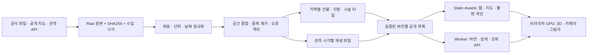

# KOREA REPLAY — 전국 도시·교통 3D 지도 개발 계획

갱신: 2026-09-19. 전국 원천 범위를 유지하면서 정밀도 계약·단계별 적재·자동 화질·무료 정적 배포를 통합하는 계획입니다. 실제 완료 여부는 [STATUS.md](STATUS.md), [VALIDATION.md](VALIDATION.md), 원본 해시와 실행 결과로 판단합니다. 배포·공개·복구의 운영 기준은 [STATIC_DEPLOYMENT.md](STATIC_DEPLOYMENT.md)입니다.

전국 지도·패널 제어·지도 집중 개선판은 Workers Static Assets Free에서 공개 운영 중이며 미리보기·공개 검사와 롤백을 검증했습니다. 현재 관측에는 전국 TAGO 도시·노선 선택, 서울 1호선 역 상태, 레이더·위성 원본 영상이 연결됐습니다. [공식 관측 연결](LIVE_CONNECTION_20260919.md)에 정확한 범위가 있습니다. 중앙 교통 호출 예산·캐시의 원격 검증과 공개 연결을 마쳤습니다. [중앙 서버 배포](CENTRAL_LIVE_DEPLOYMENT.md)를 기준으로 다음 단계는 건물 부품 후보의 공개 계층 통합, 전경 GPU 성능의 반복 측정입니다. 연속 운행 이력과 모든 실제 건물 정확성은 아직 완료되지 않았습니다. 계획의 목표를 완료 결과로 읽지 않습니다.

## 1. 제품의 목표

대한민국 어느 지역이든 찾아가 지형·도시·교통 기반 시설을 3D로 탐색하고, 실제 보유한 교통·기상 기록과 햇빛을 같은 시각으로 볼 수 있는 웹 지도입니다. 서울·경기·인천, 대전·세종·청주뿐 아니라 모든 시도·도서를 개발 범위에 둡니다.

첫 사용자는 특정 동네나 시설이 어떻게 생겼는지, 주변 교통망이 어디로 연결되는지, 보유 기록 시각에 무엇이 관측되었는지 보고 싶은 사람입니다. 서비스의 첫 성공은 **장소 검색 → 3D 이동 → 시설 선택 → 날짜·시각 변경 → 근거 확인 → 같은 장면 공유**가 끊김 없이 작동하는 것입니다.

웹 지도와 항공·도시 시뮬레이터에서 참고할 핵심은 지도 중심 화면, 단계별 상세도, 자연스러운 카메라 이동, 명확한 레이어와 시간 조작입니다. 비행 물리·교통 수요 예측·차량 제어는 별도 기능이며, 정적 지도를 만들었다고 물리적 월드 시뮬레이터까지 완성된 것으로 표현하지 않습니다.

## 2. 개발 범위와 정확도

| 대상 | 제공할 내용 | 정확도와 남은 조건 |
|---|---|---|
| 지형 | 전국 탐색과 동네 확대용 고도 타일 | 원본 해상도·고도 기준 표시. 항만 매립지·고가도로를 DEM만으로 복원하지 않음 |
| 건물 | 외곽, 지붕·부분 형상, 높이, 선택 가능한 출처 | 원천 높이·행정대장 높이·층수 추정·격자 평균 추정을 개별 구분 |
| 도시 | 신도시·구도심·행정 지명·생활권 탐색 | 지도 지명을 도시개발사업 지정 경계로 오해하지 않음 |
| 도로 | 간선·지방도로·생활도로, 교량·터널 원천 태그 | 지상 투영과 실제 수직 형상 구분 |
| 철도 | 전국 선로·역, 역별 기록, 검증 가능한 구간 이동 계산 | 실제 배정 선로·연속 GPS 미확보는 공개 설명 |
| 지하철 | 원천 노선 관계·역 좌표·심도와 역간 높이 보간 | 공식 심도 없는 구간은 미해결. 가상의 일정 깊이로 메우지 않음 |
| 버스 | 정류장·터미널·노선, 공식 API를 수집한 이후 위치 기록 | 과거 기록을 새로 만들어낼 수 없음. 수집 시작일·조회 시각 표시 |
| 항만·선박 | 항만·부두·여객선터미널·항로 | 선박별 기록은 별도 허가·이용 범위를 확인한 뒤 연결 |
| 공항·항공 | 공항·활주로·유도로·터미널 | 민간 항공편 기록·운항계획과 실제 위치를 구분. 임의 항공기 이동 없음 |
| 산업단지 | 공개 지정 경계 또는 지도 산업 용지 | OSM 산업 용지는 공식 지정 산업단지와 다른 범주 |
| 기상 | 원본 위성·레이더 시각과 좌표를 보존한 영상 | 원본 밝기·색상을 실제 구름 체적이나 정밀 강우량으로 단정하지 않음 |
| 태양 | 좌표·UTC 시각의 고도·방위각·그림자 | 그림자 정확도는 지형·건물 모델에 종속 |

‘전국’은 작업 범위입니다. 공개 지도에 없는 건물까지 검증 없이 존재하는 것으로 채우지 않습니다. **모든 위치가 정확하다**는 판정에는 비교 가능한 독립 기준 자료와 실제 누락·오차 검사가 필요합니다.

## 3. 데이터 우선순위

1. **즉시 수집 가능한 원천으로 전국 기본 지도를 완성합니다.** Overture 건물, OSM 지명·도로·철도·시설, Mapzen 고도, Natural Earth 소축척 경계가 해당합니다.
2. **개별 건물 높이와 형태를 보강합니다.** 원천에 연결된 `building_part`를 검수하고, 공식 GIS건물통합정보 외곽·행정 높이를 안전하게 결합합니다. 같은 건물이라는 근거 없이 인접 건물 높이를 복사하지 않습니다.
3. **고해상도 자료는 별도 허가와 정확도 검증을 거칩니다.** S-Map, VWorld 등은 서비스 공개 여부와 원본 다운로드·재배포 허용을 구분합니다. 접근 제한을 우회하지 않습니다.
4. **실제 관측은 원본부터 축적합니다.** TAGO·철도·기상 원천의 날짜, 호출 한도, 사용 범위를 확인합니다. 시간표나 모형 주행을 관측으로 바꾸지 않습니다.

현재 Google의 공식 한국 커버리지 표는 한국 포토리얼 3D 제공을 해결 경로로 뒷받침하지 않습니다. VWorld LoD1도 공식적으로 층수 기반 추정과 일부 제외를 명시합니다. ‘다른 지도에서 보인다’는 사실만으로 원본을 대량 복제하거나 정확성을 보장하지 않습니다. 세부 근거는 `NATIONAL_DATA_UPGRADE.md`를 참고하세요.

## 4. 공간·시간·출처 모델

- 공간 기준: WGS84 경위도, 모델 고도는 WGS84 타원체고. 국가별 원천 투영좌표계와 수직 기준을 원본 메타데이터에 보존합니다.
- 시간: 내부 UTC, 한국 화면 Asia/Seoul. 공간 자료 기준일과 관측 시각을 혼합하지 않습니다.
- 고정 공간 자료: 국토 루트 → 지역 JSON → 대표 중간 LOD → 상세 모델. 작은 타일은 공간적으로 묶고 큰 타일은 원본 피처 경계에서 나눕니다. 상세 목표는 약 4MiB이고 최종 파일·정점·바이트 예산으로 판정합니다.
- 관측: 조회 시각과 실제 관측 시각을 구분합니다. 관측 사이만 보간하고 긴 공백·종료 이후는 외삽하지 않습니다.
- 버전: 불변 타일·해시·데이터 릴리스와 Cloudflare 배포 UUID를 함께 고정합니다. 공개와 복구는 검증한 Worker 버전으로 트래픽을 전환하며 코드·지도 파일이 같은 버전으로 이동합니다. 없는 공유 버전을 최신으로 대체하지 않습니다.
- 목록: CatalogV2의 작은 공개 목록과 지역·시간별 참조를 사용합니다. 자산마다 바이트·피처·정점·상세도 정보가 있고 기존 v1 API는 사전 생성 파일 스트리밍으로 유지합니다.
- 검색: 사전 생성한 부분문자 색인을 브라우저 Web Worker와 API가 함께 사용합니다. 50,000개 게시 범위, 한글·영문 별칭·결과 순서·동일 ID 중복 제거를 유지합니다. 실제 주소 검색 API는 인증·사용 정책을 확인한 별도 어댑터입니다.

### 높이와 지하철 계약

원천 ID, 원천 높이, 표시 높이, 높이 의미, 지표고 기준과 품질 플래그를 분리합니다. 원천의 0.01m 같은 낮은 값, 시작 높이의 의미 충돌, 해안 이상 표고를 임의 값으로 덮어쓰지 않습니다. 검토 중인 건물은 외곽선으로 유지합니다. OSM의 확인된 ground-to-top 값에는 `상단=지표고+height`를 적용하며 `min_height`를 일괄 추가하지 않습니다.

전국 3,730,526행 품질 판정을 적용한 최종 생성 수는 상세 모델 3,687,673개와 검토 외곽 42,853개로 일치했습니다. 외곽은 원천 높이 미확인 42,507개와 추가 검토 346개로 나뉩니다. 약 93.2%의 GHSL 평균 높이 추정은 계속 추정으로 표시합니다. 공식 건물·부품은 동일 개체와 높이 의미가 확인된 경우만 연결합니다.

서울 공식 심도는 277행 중 276행에 숫자 높이가 있으며 +100.3m 원천 오프셋을 보존합니다. 수직 기준면이 확인되지 않은 상태에서 임의 절대 Z를 적용하지 않습니다. 품질 정보를 추가한 265역의 geometry는 보존했고 역간 구간은 추정으로 남깁니다. 해안 3개 표본의 독립 DSM 비교도 자동 지표고 교체 근거로 사용하지 않습니다. 자세한 판정은 [HEIGHT_QUALITY.md](HEIGHT_QUALITY.md)에 있습니다.

### 화면 작업량과 서버 역할

원천 정제·좌표 검사·LOD/색인 생성은 노트북 배치, 게시한 파일 제공은 Cloudflare, 렌더링은 접속 브라우저/GPU가 담당합니다. 배포 후 노트북을 꺼도 게시한 자료를 열 수 있지만 배포만으로 접속 기기의 3D 계산이 사라지는 것은 아닙니다.

일반 도로·철도·시설은 무거운 Entity 대신 배치 Primitive로 만들고 원본 속성은 별도로 보존합니다. 공간별 적재, 예상 바이트·정점·메모리 예산, 동시 다운로드 제한과 화면 중앙·근거리 우선순위를 적용합니다. 이동 뒤에도 필요한 요청은 재사용합니다.

자동 화질은 이동 중 해상도·상세도·그림자 비용을 낮추고 정지 후 복원합니다. 지속된 프레임 저하와 충분한 회복 구간으로 단계 전환을 판단합니다. 시간 재생은 정적 지도 적재와 분리하고 교통·태양과 실제 기상 프레임 경계만 갱신합니다.

같은 도로 4,534개의 Node 객체 생성에서 추가 heap은 184.87→20.92 MB(88.68% 감소), 유지 heap은 180.58→7.00 MB(96.12% 감소)였습니다. 이는 브라우저 GPU/FPS 성능 보증이 아닙니다. 실제 성능 목표와 판정은 아래 기준을 따릅니다.

## 5. 화면과 조작 기준

메인 화면은 지도이며, 홍보용 랜딩 페이지를 앞에 두지 않습니다. 왼쪽에는 지역과 레이어, 아래에는 날짜·시간, 오른쪽에는 선택 정보와 카메라 조작을 둡니다. 모바일에서는 레이어 패널을 접고 시간 조작을 항상 접근 가능하게 합니다.

- 전국: 도시·주요 시설·간선 연결과 지형을 우선합니다.
- 도시: 간선도로, 철도, 산업 용지, 공항·항만 형상을 추가합니다.
- 동네: 개별 건물과 도로·정류장을 표시합니다.
- 선택: 이름·원천·기준일·표현 높이·근거 종류를 보여줍니다.
- 기록: 실제 존재하는 날짜와 프레임으로 이동합니다. 과거 예제는 날짜와 예제 표기를 유지합니다.
- 지하: 지상 투영과 투시를 구분하며 추정 수직 형상임을 표시합니다.
- 공유: 장소·카메라·시간·레이어·데이터 릴리스·배포 버전을 보존합니다.

현재 pastel 지도 스타일을 유지하되, 텍스트 대비·조작 크기·구분 가능한 선 색·레이어 과밀을 실제 장면에서 검수합니다. 레퍼런스의 표면 색상만 모방하는 것을 디자인 완료로 판단하지 않습니다.

## 6. 전국 지형·도시 유형별 검증

| 유형 | 지역 | 필수 확인 장면 |
|---|---|---|
| 밀집·고층 | 서울·경기·인천 | 고층·밀집 저층, 서울 지하철, 수도권 신도시, 공항, 항만 |
| 산지·해안 도시 | 부산·울산·경남 | 산지 도시, 해안·부두, 산업 용지, 경부선 |
| 내륙·산악 | 대구·경북·강원 | 내륙 도시, 산악 지형, 해안 철도·공항 |
| 평야·매립지 | 광주·전라·충남 | 농촌·섬·산업단지·항만·서해 매립지 |
| 내륙 신도시·하천 | 충북·세종·대전 | 신도시와 원도심, 철도 연결, 하천 |
| 섬 | 제주·울릉·독도 및 소도서 | 작은 섬 누락, 경계, 바다와 지형, 줌 범위 |

전국이 기본 화면과 개발 범위입니다. 특정 세 도시를 우선 지역으로 두지 않으며, 밀도·지형·해안·도서처럼 오류와 부하 특성이 다른 장면을 검증합니다. 국가 분할 작업은 전체 지역을 처리합니다.

## 7. 완료 판정

### 공간 자료

- 원본 건수, 선택 경계, 제외 이유, 유효·실패 구역 수를 재현할 수 있어야 합니다.
- 건물 원천 ID 중복·외곽 파손·단위 오류·좌표 범위·부모/부분 연결을 검사합니다.
- 높이별 출처 비율과 미확인 건수는 별도 수치입니다. 파일 수와 건물 수를 혼동하지 않습니다.
- 3D 파일 표준 검사와 화면 확인을 모두 수행합니다. 포맷 통과가 실측 정확성을 뜻하지 않습니다.
- 지면 높이와 건물 바닥 정합, 교량·터널·해안의 알려진 한계를 지역별로 기록합니다.

### 교통·기상

- 원본 보존, 실제 시각, 품질 플래그, 호출 실패와 데이터 없음의 구분이 필요합니다.
- 지하철은 노선별 관계·역 순서를 확인합니다. 근처 다른 노선에 스냅하지 않습니다.
- 레이더 원본 색상 렌더와 수치 반사도는 다른 데이터 형식입니다.
- 위성 원본 해상도와 화면 리샘플링 크기를 구분합니다.
- 연속 수집은 실제 신규 행·최신 시각·공백·호출량·복구를 대장에서 확인합니다.

### 서비스·배포

- 타입 검사·테스트·린트·빌드, 실제 브라우저 데스크톱/모바일 흐름을 검수합니다.
- Radeon 860M에서 프로덕션 빌드·고정 카메라 경로의 일반 탐색 프레임 P95 33ms 이하, 메인 스레드 분할 생성 작업당 8ms 이내를 목표로 측정합니다. 도시 왕복 이동에서 메모리가 계속 증가하지 않는지도 확인합니다.
- 전국 재타일링 전후 ID·형상을 대조하고 상세 좌표의 추가 변환 오차를 검사합니다. 포맷 검사·확장 메타데이터 감사·실기기 확인을 각각 기록합니다.
- 무료 정적 자산은 18,000파일을 목표로 생성하고 20,000개 초과 또는 파일당 24MiB 이상이면 배포를 차단합니다. 추산이 아닌 실제 의존 파일 묶음으로 판정합니다.
- 인증된 Cloudflare 계정에서 불변 전체 묶음 업로드 → 고정 미리보기 검증 → 공개 전환 → 이전 정상 버전 복구를 수행합니다. 새 Worker의 초기화와 공개 주소 연결은 [무료 운영 절차](STATIC_DEPLOYMENT.md)를 따릅니다.
- 검색·카탈로그 API의 Free CPU/요청 한도는 원격에서 확인합니다. Node 로컬 CPU와 파일 경과 시간을 Cloudflare CPU로 해석하지 않습니다.
- 비공개 원본·키 노출, 누락 자산의 SPA 응답, 비정상 범위 요청을 검사합니다.
- 사용자가 금지한 결제·유료 활성화·자료 임의 삭제는 수행하지 않습니다. 무료 범위와 기존 계정 상태를 먼저 확인합니다.
- 실제 공개·지역별 동작·복구를 확인한 정적 서비스 상태와, 이후 승인한 관측 소스의 연속 수집 상태를 별도로 보고합니다. 수집을 연결한다면 신규 원본·대장·관측 공백과 최소 72시간 운용 결과를 따로 검수합니다.

## 8. 지금 진행할 일과 외부 조건

| 순서 | 작업 | 현재 확인 |
|---|---|---|
| 1 | 높이 계약·성능 기준 고정 | 전국 원천 품질 판정과 Node 동일 형상 비교 완료 |
| 2 | 전국 LOD·공간별 타일 재구성 | 생성·병합과 공개 완료. 상세 GLB 3,448개. 건물 부품 후보의 추가 공개 통합은 별도 검증 중 |
| 3 | 브라우저·목록·검색 최적화 | 코드·회귀 검사 통과. 실제 검색 304질의 불일치 0, 최종 전국 GPU 검사 진행 |
| 4 | 무료 정적 묶음 업로드 | 공개 완료. 2026-09-19 중앙 교통 연결판은 17,401개 정적 파일이며 결제·R2·D1 활성화 없음 |
| 5 | 공개 환경·공유·복구 검증 | 미리보기·공개·롤백·복귀 HTTP 각각 67/67 통과. 실제 GPU P95 목표와 외부 백업 검증은 남음 |
| 6 | 승인된 실제 관측 연결 | TAGO 버스·서울 1호선·위성·레이더 실제 응답 및 중앙 교통 서버 연결 완료. 노선 확대·연속 관측 보관은 별도 진행 |

검색은 227파일·46,291 B 초기 manifest이며 결과·순서의 보존을 검증했습니다. [SEARCH_V2.md](SEARCH_V2.md)에 cold CPU와 원격 검증 조건을 구분했습니다. [RETILING.md](RETILING.md)는 전국 배치의 재개·ID/형상 보존·최종 감사 절차입니다.

**남은 외부 자료 조건:** 전국 열차의 현재 운행 관측, GIS건물통합정보 실제 원본, 승인형 정밀 자료의 이용 조건, 연속 관측 원본의 보관·재배포 조건입니다. TAGO·서울 도시철도·기상 영상의 승인 키와 현재 조회는 이미 연결됐습니다. 최신 검증은 [중앙 교통 배포 기록](CENTRAL_LIVE_DEPLOYMENT.md)을 따릅니다. 기본 정적 배포를 위해 R2·D1 활성화나 유료 계약을 요구하지 않습니다. 연속 수집은 현재 조회와 별도로 검증하며, 검수 대기 후보가 공개 목록을 직접 바꾸지 않게 합니다.

**한국 검증 후:** 일본 → 대만 → 베트남·동남아 → 몽골·러시아·중국의 실제 자료 가용성과 조건을 조사해 순서를 확정합니다. 이 순서는 잠정 확장 후보이며 전 지역 자료를 이미 확보한 것은 아닙니다.

## 9. 동아시아 확장 구조

국가 어댑터는 `country_code`, 경계·행정구역, 검색 언어, 시간대, 수평·수직 기준, 소스별 이용 조건, 교통 식별자와 관측 수집 규칙을 제공합니다. 공통 지도·타일·관측·출처 계약은 재사용합니다.

한국용 EPSG5186, KST, 서울 역명 결합 규칙을 다른 나라에 그대로 적용하지 않습니다. 중국 등 좌표 변환·지도 제공 조건이 다른 곳은 해당 국가 공식 문서와 실제 데이터에 맞춰 별도로 검증합니다. 항공·해상·도로·철도별로 **정적 기반 시설 / 운행계획 / 실제 관측 / 계산 위치**를 계속 분리합니다.

한국 전역의 원천 범위·성능·배포가 검증되기 전에 여러 국가의 UI만 추가해 범위를 부풀리지 않습니다.

## 관련 문서

- `ARCHITECTURE.md`: 현재 코드의 구조와 데이터 계약
- `NATIONAL_DATA_UPGRADE.md`: 공식 원천 조사와 실제 샘플 검증
- `INFRASTRUCTURE.md`: 도로·공항·항만·산업 용지 추출
- `RAIL_REPLAY.md`, `SUBWAY_DEPTH.md`: 선로·기록·심도 연결
- [STATIC_DEPLOYMENT.md](STATIC_DEPLOYMENT.md): 현재 무료 정적 배포·공개·복구 운영 기준
- [HEIGHT_QUALITY.md](HEIGHT_QUALITY.md), [RETILING.md](RETILING.md): 정밀도 계약과 전국 타일 생성·감사
- [SEARCH_V2.md](SEARCH_V2.md): 부분검색 색인·결과 보존·CPU 검증
- [STATUS.md](STATUS.md), [VALIDATION.md](VALIDATION.md): 실제 확인 결과와 남은 공개·GPU·복구 조건
- `OPERATIONS.md`: 이전 R2 구조의 참고 기록. 현재 배포 실행 절차는 STATIC_DEPLOYMENT를 사용
